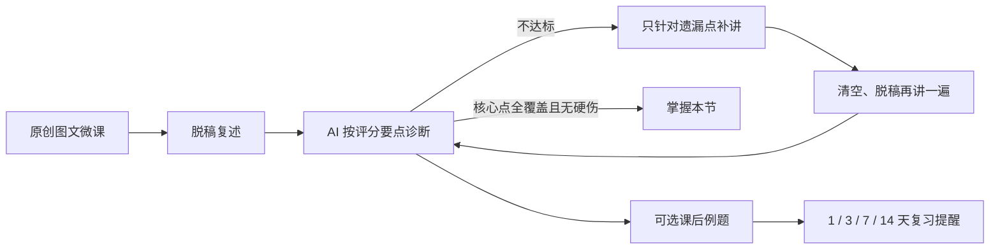

# Be better

> 用简短微课教你一件事，再让你讲出来、用在新题上，并提醒你按时复习。

Be better 是一个 **AI 掌握度引擎（Mastery Engine）**，当前以「大学英语四级阅读」为第一个试验场景。核心流程是：**学一小节 → 脱稿复述 → AI 按要点诊断 → 定点补讲 → 再讲一遍 → 可选课后例题与间隔复习**。课程可自由选择，掌握度用于反馈与复习提醒。

- 在线体验：https://be-better-off.zeabur.app
- 技术栈：Next.js（App Router）+ TypeScript + Tailwind CSS + DeepSeek API，部署在 Zeabur
- 形态：移动端优先的 Web 应用，进度保存在本地浏览器，无需注册即可体验

<!-- 效果演示：建议在此放 1 张课程地图截图 + 1 张诊断/补讲截图，命名为 docs/demo-map.png、docs/demo-diagnosis.png 后用  引入 -->

---

## 一、它解决什么问题

普通的学习类 AI 产品，大多停在「把知识讲给你听」这一步：给路径、给方法、给一篇答案，**至于你到底学会没有，没有人确认**。于是常见的情况是：看的时候都懂，合上材料就忘，考试还是不会。

学习科学里的「主动回忆 / 费曼技巧」和「测试效应」表明：**脱离材料后自己讲一遍，比反复阅读更能形成长期记忆**；但如果提示太宽泛，学习者也可能自信地重复一个错误理解。Be better 要解决的正是后半段——

- 你得**先自己讲**，而不是看答案；
- AI 拿着一份预先定义好的**评分要点（rubric）**判断你哪里没讲清、哪里讲错了；
- 它**不直接把完整答案给你抄**，而是只针对你这次漏掉的点做最小补讲；
- 你再脱稿讲一遍，检查核心要点是否覆盖；之后可做迁移小题，并按提醒间隔复习。

## 二、和现有产品的区别

| 产品类型 | 典型交互 | 谁来确认"你学会了" |
| --- | --- | --- |
| 网课 / 教学视频 | 看完即结束 | 没人确认 |
| 题库 App | 做题、对答案、看解析 | 只判断选项对错，不判断你是否理解方法 |
| 通用 AI 问答 | 你问它答，直接给方法和范文 | 不主动考核，也容易直接替你写完 |
| **Be better** | **学 → 讲 → 诊断 → 定点补讲 → 例题讲解 / 对答案 → 复习** | **AI 按 rubric 给反馈，并提示后续复习** |

## 三、核心闭环



## 四、当前已实现

- **12 节原创图文微课**：覆盖四级阅读三类题型，新增长篇阅读匹配、同义改写、篇章结构、长难句、词形、搭配与综合复盘；每节将常用必会与拔高选学分开展示。
- **脱稿复述**：学完用自己的话把方法讲一遍，可打字或使用浏览器语音转文字。
- **AI 诊断**：服务端调用大模型，按每节预置的评分要点判定覆盖、遗漏与硬伤错误，返回覆盖率、错误清单、鼓励和参考讲法。
- **定点补讲**：不通过时，AI 只围绕本次遗漏点和错误生成补讲卡片（思路 + 小例子 + 记忆提示），完整参考答案默认折叠，避免照抄；清空后脱稿再讲，直到达标。
- **可选课后例题**：每节两道原创练习，先作答；之后可语音或打字按题号讲选择和证据，接受 AI 逐题反馈，也可直接对答案并看解析。讲解期间题目仍可查看。
- **掌握度与复习**：核心要点全覆盖且无硬伤为“已掌握”；未达到时可继续补讲和重试，课程仍可自由选择。进度按 1、3、7、14 天显示复习提醒。
- **本地进度**：完成状态、最佳核心覆盖率、尝试次数和复习时间保存在浏览器 `localStorage`。

## 五、几个关键的产品与工程决策

这部分是我作为产品负责人最想讲清楚的取舍，也是这个项目区别于"套壳聊天机器人"的地方。

1. **不搬运第三方视频，核心内容自有化。**
   公开视频存在版权、失效、质量参差、与考核标准不一致等问题。微课内容基于四六级公开真题、官方答案解析与考纲中的成熟解题方法做**原创改写**，每节配一份与微课小节一一对应的 rubric，保证"教的内容"和"考的标准"是同一套东西。

2. **模型只做语义判断，分数由程序重算，不信任模型自报。**
   大模型负责判断"这段话有没有覆盖某个要点"，但覆盖率、是否通过一律在服务端和前端**各重算一次**；全部核心要点覆盖且没有硬伤才标为“已掌握”。模型输出在服务端做 id 白名单过滤、字段归一化和失败重试。

3. **诊断与补讲分离，且不直接喂答案。**
   `/api/diagnose` 只负责按 rubric 评判；不通过时由 `/api/remedy` 针对**具体遗漏点**做最小补讲，并在提示词里明确禁止输出可照抄的完整复述。完整参考讲法默认折叠，第二次复述会清空输入框——刻意制造"脱离材料主动提取"的难度，因为这正是学习发生的地方。

4. **AI 可能把"说得像"误判成"真的懂"，所以标准要可校准。**
   rubric 锚定具体可解释的解题方法而非模型自由发挥；每节新增原创迁移小题，让学生把方法用到新材料上。人工标注样本校准仍是后续工作。

5. **入口刻意做窄。**
   "让人变得更好"是长期愿景，但用户第一次会搜索的是"四级阅读主旨题怎么做"这类具体问题。因此先用四级阅读这一个可验证的场景把闭环跑扎实，再把同一套掌握度引擎迁移到其他知识型、乃至动作型领域（如健身、发声，需要关键点检测等不同诊断器）。

## 六、关于 AI 协作（Vibe Coding）

我本人是非计算机专业背景，这个项目**由我独立完成产品定义、内容结构、评分标准设计、接口契约与验收**，并使用 Codex 等 AI 编程工具协作完成编码、调试与部署：

- 我定义页面、状态机、数据结构和每个接口的输入输出与边界条件；
- 我编写每节微课与 rubric 文案，并规定模型系统提示词的评判规则；
- 我用真实用例做验收：对每节课分别提交"乱讲"和"讲全"两类复述，验证覆盖率、硬伤判定、解锁与进度持久化是否符合预期；
- 密钥只放在服务端环境变量，经 Route Handler 代理调用，不暴露给前端；`.env.local` 已加入 `.gitignore`。

这是一次"产品经理用 AI 把自己的设计真正做成可上线产品"的完整实践。

## 七、目录结构

```
app/
  learn/
    page.tsx                 # 12 节课程地图与复习提醒
    [id]/page.tsx            # 单节课数据装配
    [id]/LessonStage.tsx     # 学微课 / 复述 / 诊断与定点补讲 三阶段
    [id]/practice/page.tsx   # 课后例题与两种复盘路径
  api/
    diagnose/route.ts        # AI 复述诊断（按 rubric 评分）
    remedy/route.ts          # 针对遗漏点的定点补讲
    practice/diagnose/route.ts # 例题讲解诊断
  me/page.tsx                # 我的进度
lib/
  lessons.ts                 # 原有微课与课程汇总
  curriculum.ts              # 新增微课、分层内容和原创例题
  types.ts                   # 课程、诊断、补讲类型定义
  storage.ts                 # 本地进度（localStorage）
  env.ts                     # 环境变量校验
```

## 八、本地运行

```bash
npm install
npm run dev
```

打开 http://localhost:3000 。Windows 下若 PowerShell 拦截 `npm.ps1`，改用 `npm.cmd run dev`。

复制 `.env.local.example` 为 `.env.local`，填入 DeepSeek API Key：

```bash
DEEPSEEK_API_KEY=sk-xxxx
```

`.env.local` 已在 `.gitignore` 中，不会被提交。

## 九、部署（Zeabur）

1. 在 Zeabur 新建 Project，从 GitHub 导入本仓库，平台会自动识别 Next.js；
2. 在服务的 Variables 中配置 `DEEPSEEK_API_KEY`；
3. Build 用 `npm run build`、Start 用 `npm run start`，端口由平台注入；
4. 更新代码后在 Zeabur 点 **Redeploy**（Restart 只重启旧产物，不会拉取新代码）。

## 十、路线图

- [x] 12 节四级阅读图文微课 + 费曼复述 + rubric 诊断
- [x] 针对遗漏点的定点补讲，不直接给完整答案
- [x] 1 / 3 / 7 / 14 天复习提醒
- [x] 同题型原创迁移小题、讲题反馈与直接看解析
- [x] 浏览器语音转文字复述和讲题
- [ ] 引入人工标注样本校准 AI 评分，并验证长期留存
- [ ] 把掌握度引擎迁移到一个动作型场景（如深蹲，需姿态关键点诊断）

## 十一、内容与免责说明

本项目为个人学习与产品实践作品，与四六级考试官方无关。课程参考公开试卷和考试大纲，课后例题均为原创缩短版练习，不收录真题原文或第三方视频。资料链接与范围见 [CONTENT_SOURCES.md](CONTENT_SOURCES.md)。本产品不保证记忆保持或考试结果，完整备考仍需结合正式真题和限时训练。
